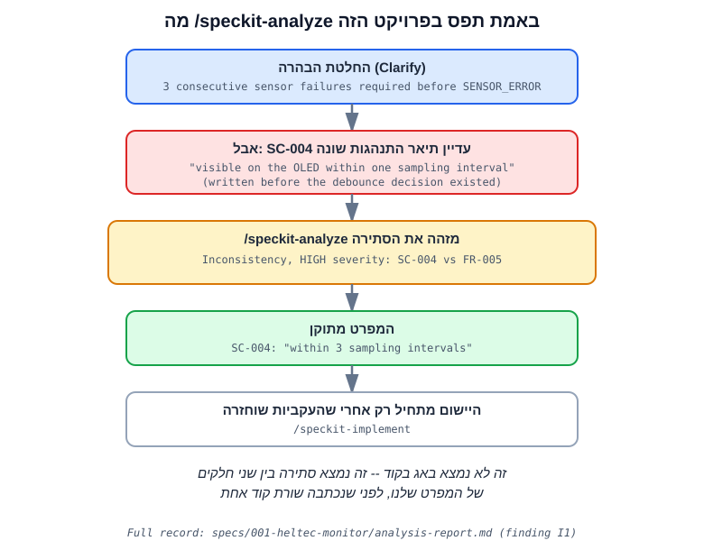

# Textbook: Spec-Driven Development with GitHub Spec Kit

This is a standalone learning resource. You do not need to have attended
the workshop to follow it — every command here is real, every file it
references exists in this repository, and every hardware fact was
verified against a current source (cited inline) rather than assumed.

The running example throughout is a real device: an environmental monitor
on a **Heltec WiFi Kit V3** (ESP32-S3) with a BME280 sensor and its
onboard OLED. You can read this textbook end to end, or jump straight to
[Chapter 16](#16-the-heltec-wifi-kit-v3-example) if you already know what
Spec-Driven Development is and just want the hardware walkthrough.

## Table of contents

1. [AI-Assisted Development](#1-ai-assisted-development)
2. [The Problem With Prompt-to-Code](#2-the-problem-with-prompt-to-code)
3. [What Is Spec-Driven Development?](#3-what-is-spec-driven-development)
4. [What Is GitHub Spec Kit?](#4-what-is-github-spec-kit)
5. [Installing Spec Kit](#5-installing-spec-kit)
6. [Development Environment: VS Code](#6-development-environment-vs-code)
7. [JetBrains / CLion](#7-jetbrains--clion)
8. [Using Spec Kit With Claude Code](#8-using-spec-kit-with-claude-code)
9. [Using Spec Kit With Codex](#9-using-spec-kit-with-codex)
10. [Constitution](#10-constitution)
11. [Specify](#11-specify)
12. [Clarify](#12-clarify)
13. [Plan](#13-plan)
14. [Tasks](#14-tasks)
15. [Analyze](#15-analyze)
16. [The Heltec WiFi Kit V3 Example](#16-the-heltec-wifi-kit-v3-example)
17. [Implement: Full Walkthrough](#17-implement-full-walkthrough)
18. [Prompt-Only vs. Spec-Driven Comparison](#18-prompt-only-vs-spec-driven-comparison)
19. [Common Mistakes](#19-common-mistakes)
20. [Troubleshooting](#20-troubleshooting)
21. [Best Practices](#21-best-practices)
22. [When Not to Use Spec Kit](#22-when-not-to-use-spec-kit)
23. [Next Steps](#23-next-steps)

---

## 1. AI-Assisted Development

Coding agents like **Claude Code** and **Codex CLI** can read a repository,
write and edit files, run shell commands, and iterate on their own output.
This is a real capability shift: tasks that used to take an engineer hours
of typing now take minutes of agent time.

What did *not* change is where software projects actually fail. Most real
failures are not "the code has a bug" — they are "the code does exactly
what was asked, and what was asked was wrong, incomplete, or never
actually agreed on." AI coding agents make it dramatically cheaper to
produce *an* implementation. They do nothing to make the underlying
product decisions for you. If anything, because the output looks
confident and complete, it becomes easier to skip the step of deciding
what you actually want.

## 2. The Problem With Prompt-to-Code

Consider this prompt, used verbatim in this repository's
[`examples/prompt-only/`](../examples/prompt-only/):

```text
Build an application for a Heltec WiFi Kit V3 that reads a sensor,
shows the value on the display, and shows a warning when the value is too high.
```

Nothing else was said. Look at
[`examples/prompt-only/naive_monitor.ino`](../examples/prompt-only/naive_monitor.ino)
and its accompanying
[README](../examples/prompt-only/README.md): a plausible-looking sketch
came out, and every one of these was invented, silently, because the
prompt never said otherwise:

- Which sensor (DHT22, guessed)
- Sampling interval (1 second, guessed)
- What "too high" means numerically (`30`, guessed, no unit confirmed)
- Whether the threshold is `>` or `>=` (guessed)
- When the warning clears (no hysteresis — it flickers right at the edge)
- What happens on sensor failure (prints "Sensor error," no debounce, no
  defined recovery)
- Whether any of this logic can be tested independently of the hardware
  (it can't — it's all inline in `loop()`)

None of this is a coding failure. The AI wrote confident, syntactically
correct C++ for a product that was never actually specified — and it did
so with the board's I2C wiring and power sequencing correct, because
those are verifiable hardware facts, not product decisions. That
distinction matters: no amount of hardware knowledge would have told the
agent which sensor the user wants, what temperature counts as "too
high," or whether the warning needs hysteresis. Only a human stakeholder
can answer those, and the vague prompt never asked. See
[`examples/prompt-only/README.md`](../examples/prompt-only/README.md)
for the full "implicit assumption vs. explicit decision" framing.

The prompt→fix loop this produces looks like:

```text
Prompt → AI → Code → Fix → Prompt → Fix → Prompt → Fix → ...
```

Each "Fix" is a product decision made *after* code already exists to
contradict it, under time pressure, usually without being written down
anywhere durable. Two weeks later, nobody — human or AI — can tell you
whether the exact-30°C behavior was a deliberate choice or an accident.

## 3. What Is Spec-Driven Development?

Spec-Driven Development inverts the order: make the important decisions
*before* asking an agent to write the implementation, and write those
decisions down somewhere durable — the repository — rather than leaving
them in chat history.

```text
Idea → Specification → Clarification → Technical Plan → Tasks → Implementation → Validation
```

This is not bureaucracy for its own sake. Every stage exists to catch a
specific class of mistake before it becomes code:

| Stage | Catches |
|---|---|
| Specification | "We never agreed what this does" |
| Clarification | "We agreed on the happy path, not the edges" |
| Plan | "We agreed what, not how, and 'how' has real constraints" |
| Tasks | "We know the plan, not the order or the dependencies" |
| Analyze | "Two of our own documents quietly disagree with each other" |
| Implementation | (this is where prompt-only *starts* — here it's the last step) |

The core message of this whole workshop:

> The problem is usually not that the AI cannot write the code. The
> problem is that the product behavior was not sufficiently defined.

## 4. What Is GitHub Spec Kit?

[GitHub Spec Kit](https://github.com/github/spec-kit) is a toolkit — a
CLI (`specify`) plus a set of agent skills/commands — that implements the
Spec-Driven Development workflow as repository artifacts instead of chat
messages. It does not write your code. It structures the *process* that
leads up to a coding agent writing your code, and it leaves behind a
paper trail (`spec.md`, `plan.md`, `tasks.md`, ...) that survives after
the chat session that produced them is gone.

The core workflow, as installed in this repository (`specify` v0.12.15):

```text
constitution → specify → clarify → plan → tasks → analyze → implement
```

Two more exist for later in a feature's life: `checklist` (an optional
quality gate after `plan`) and `converge` (assess an existing codebase
against its spec and append any leftover work as new tasks). This
workshop focuses on the seven-stage core path.

**Important distinction**, because it's easy to conflate the three:

```text
Spec Kit
= the workflow + the specification files + the repository artifacts

Claude Code / Codex
= the coding agent that reasons, edits files, runs commands, implements

IDE
= the human's workspace: editing, Git, terminal, debugging, build, navigation
```

Spec Kit is not itself a coding agent. It hands a coding agent (Claude
Code, Codex, or 30+ others) a set of skills/commands that produce and
consume the artifacts above. Because those artifacts are plain Markdown
files in your repository, the same project is usable from more than one
agent — see [Chapter 8](#8-using-spec-kit-with-claude-code) and
[Chapter 9](#9-using-spec-kit-with-codex).

## 5. Installing Spec Kit

Verified against `specify --version` → `0.12.15.dev0` and `specify init
--help` in this repository, 2026-09-10.

```bash
# Prerequisite: uv (https://docs.astral.sh/uv/)
uv tool install specify-cli

# Confirm the toolchain is ready
specify check
```

Initialize into an **existing** repository (what this project did):

```bash
specify init --here --force --integration claude
```

- `--here` initializes in the current directory instead of creating a new
  project folder.
- `--force` skips the "directory is not empty" confirmation prompt.
- `--integration claude` installs Claude Code's skill files. Run
  `specify integration list` to see all ~40 supported agent integration
  keys (Claude, Codex, Copilot, Gemini, Cursor, and many more).

This does **not** require network access at run time — the CLI bundles
its templates, so `specify init` scaffolds from what's inside the
installed `specify-cli` package.

### Adding a second agent to the same project

```bash
specify integration install codex
```

This is exactly what this repository did — see
[Chapter 9](#9-using-spec-kit-with-codex) for what it actually installs
and why the invocation syntax differs from Claude Code's.

## 6. Development Environment: VS Code

VS Code is this workshop's primary environment: good Git integration, a
solid built-in terminal (where you actually run `specify`, `pio`, `claude`,
and `codex`), Markdown preview for reading the spec files, and mature
PlatformIO support for the firmware side.

**Recommended minimal setup:**

| Extension | Why |
|---|---|
| Built-in Git | You need to see diffs across spec/plan/tasks/code as they evolve together — this is the whole point of the workflow |
| Built-in integrated terminal | Every Spec Kit command, `pio`, `claude`, and `codex` are CLI-first by design, so the repo stays portable |
| **PlatformIO IDE** | Build/upload/monitor the Heltec firmware without leaving the editor; verified working with `board = heltec_wifi_kit_32_V3` (see `firmware/platformio.ini`) |
| **C/C++** (ms-vscode.cpptools) | IntelliSense, go-to-definition, and inline diagnostics across `firmware/src` and `firmware/include` |
| Markdown preview (built-in) | Read `spec.md`/`plan.md`/`textbook.md` rendered, not as raw text |
| GitLens (optional) | Useful for narrating *why* a line changed during a live demo, not required |
| Error Lens (optional) | Surfaces compiler diagnostics inline; nice-to-have, not load-bearing |

Deliberately **not** recommended: a dedicated "Spec Kit extension." None
is needed — the workflow is CLI + plain Markdown files + your coding
agent's own editor integration (Claude Code's VS Code extension, or
just its CLI in the integrated terminal). Anything installed only to pad
the extension list was left out.

## 7. JetBrains / CLion

The Spec Kit artifacts (`.specify/`, `specs/`, skill files) are plain
files in the repository — nothing about them is VS Code–specific. From
CLion (or any JetBrains IDE):

- Use the built-in terminal to run `specify`, `pio`, `claude`, `codex`
  exactly as in VS Code.
- CLion has native PlatformIO support (via the PlatformIO plugin, or by
  importing the `firmware/` `platformio.ini` project directly), giving you
  proper C++ indexing, debugging, and build integration for the firmware.
- Use the built-in Git tooling and Markdown preview the same way.

The one thing that differs between editors is which *agent skill files*
get invoked as slash/dollar commands inside a chat panel — that's an
editor/agent-integration detail, not a Spec Kit detail. The underlying
`specs/001-heltec-monitor/*.md` files and `.specify/` scripts are
identical no matter which editor opens them. This workshop demonstrates
VS Code live; this paragraph is the entire JetBrains section on purpose —
there is nothing else that needs to differ.

## 8. Using Spec Kit With Claude Code

Installed via `specify init --here --integration claude`. Verified
contents of this repository's `.specify/integration.json`:

```json
"claude": { "script": "sh", "invoke_separator": "-" }
```

This installs one Markdown **skill** file per command under
[`.claude/skills/`](../.claude/skills/) (e.g.
`.claude/skills/speckit-specify/SKILL.md`), invoked in a Claude Code
session as:

```text
/speckit-constitution
/speckit-specify
/speckit-clarify
/speckit-plan
/speckit-tasks
/speckit-analyze
/speckit-implement
```

Note the **hyphen**, not a dot (`/speckit-specify`, not
`/speckit.specify`) — this is what the installed `invoke_separator: "-"`
actually produces in this Spec Kit version; older docs and blog posts
may show a dot-separated form from an earlier release. Always trust what
`specify init` actually installs in your project over what a tutorial
says, exactly as Constitution Principle III insists for hardware facts —
the same discipline applies to tool versions.

## 9. Using Spec Kit With Codex

Added to the same repository with:

```bash
specify integration install codex
```

This installs the same nine skills under
[`.agents/skills/`](../.agents/skills/) (a shared, agent-agnostic
convention — several agents besides Codex read from `.agents/`), and
Codex invokes them with a **dollar prefix** instead of a slash:

```text
$speckit-constitution
$speckit-specify
...
```

The two integrations share the exact same `.specify/templates/` and
`.specify/scripts/bash/*.sh` — the only thing that differs is the
invocation syntax and where the skill/command files live. This is the
concrete proof, not just a claim, that the workflow is portable: run
`specify integration list` in this repository and you'll see both
`claude` and `codex` marked installed against the same `specs/` and
`.specify/` directories.

## 10. Constitution

**Command**: `/speckit-constitution` (Claude Code) / `$speckit-constitution`
(Codex)

**Produces**: [`.specify/memory/constitution.md`](../.specify/memory/constitution.md)

The constitution is where you write down the rules that must never be
silently broken, before any feature-specific work starts. It's checked
against automatically during `/speckit-plan` and `/speckit-analyze` (a
constitution violation is always flagged CRITICAL).

This project's constitution has five principles, each chosen because it
closes a real gap this exact feature would otherwise fall into — for
example, Principle I ("Decision Logic Is Hardware-Independent") is the
reason `firmware/include/monitor_logic.h` has zero Arduino includes and
can be unit tested with `pio test -e native` with no board attached. Read
the full file — it's short — rather than taking this summary as a
substitute.

## 11. Specify

**Command**: `/speckit-specify <description>`

**Produces**: `specs/NNN-feature-name/spec.md` (this project:
[`specs/001-heltec-monitor/spec.md`](../specs/001-heltec-monitor/spec.md))

Turns a natural-language feature description into structured user
stories (prioritized P1/P2/P3), functional requirements (`FR-001`,
`FR-002`, ...), and success criteria (`SC-001`, ...). Crucially, where the
description didn't specify something, `/speckit-specify` is supposed to
leave a visible `[NEEDS CLARIFICATION: ...]` marker rather than silently
guessing — compare this project's spec.md at
[checkpoint `03-spec-created`](#git-checkpoints-recap) (still had
clarification markers) against the same file after
[`04-spec-clarified`](#git-checkpoints-recap) (all resolved).

## 12. Clarify

**Command**: `/speckit-clarify`

**Modifies**: the same `spec.md`, in place, appending a dated
`## Clarifications` section.

This is where the vague prompt's open questions get real answers, asked
one at a time, each with a recommended default and a short rationale so
the person answering isn't starting from nothing. In this project, five
questions were asked (sampling interval, exact-threshold behavior,
failure debounce, error-display content, Serial frequency) — see
`spec.md`'s `## Clarifications` section for the exact Q&A. Every answer
is then folded back into the relevant `FR-###`/edge case, and the
`NEEDS CLARIFICATION` markers are removed.

**This is the single most misunderstood stage.** It looks like it's just
asking questions. What it's actually doing is forcing a human decision at
the one point where making it is nearly free — before code exists to
either encode the wrong answer or make the right answer expensive to
retrofit.

## 13. Plan

**Command**: `/speckit-plan <technical context>`

**Produces**: `specs/NNN-feature-name/plan.md`, `research.md`,
`data-model.md`, `contracts/`, `quickstart.md`

This is the first stage that touches *how*, not just *what*. It fills in
a Technical Context (language, dependencies, testing approach, target
platform), runs a Constitution Check against every principle, and then
produces:

- **`research.md`** — every non-obvious technical/hardware decision, with
  its rationale and the alternatives considered. This project's
  `research.md` is where the verified Heltec OLED pins (`SDA=17, SCL=18,
  RST=21` — not the generic ESP32 default 21/22) and the `Vext`
  power-sequencing requirement live, sourced from Heltec's own
  factory-test firmware rather than assumed.
- **`data-model.md`** — the entities and, where relevant, their state
  transition table. This project's is the exact transition table
  `monitor_logic.cpp` implements.
- **`contracts/`** — this device's only external interface (one Serial
  line format) documented as a contract, even though it isn't a web API.
- **`quickstart.md`** — the concrete steps to validate the feature works,
  split clearly into "no hardware required" and "requires the physical
  board" sections.

## 14. Tasks

**Command**: `/speckit-tasks`

**Produces**: `specs/NNN-feature-name/tasks.md`

Turns the plan into a dependency-ordered, checkbox-per-task list,
organized by user story so each story is independently
implementable/testable/demoable. This project's
[`tasks.md`](../specs/001-heltec-monitor/tasks.md) has 24 tasks across
Setup, Foundational, three user-story phases, and Polish — each with an
exact file path, so "an LLM can complete it without additional context"
(the actual instruction baked into the `speckit-tasks` skill).

## 15. Analyze

**Command**: `/speckit-analyze`

**Produces**: a read-only report (this project also saved it, as
[`analysis-report.md`](../specs/001-heltec-monitor/analysis-report.md),
for teaching purposes — the real command does not write a file by
default).

This is the stage most tutorials skip, and it's the one this workshop
insists on keeping, because it's where Spec Kit caught a genuine mistake
in this very project — not a hypothetical one written for the slides.
Here is exactly what happened, in order:

```text
Clarification decision
        ↓
3 consecutive sensor failures required before SENSOR_ERROR (FR-005)
        ↓
Existing SC-004 still described incompatible behavior
("visible on the OLED within one sampling interval" — written
 before the debounce decision existed)
        ↓
/speckit-analyze detects the contradiction (finding I1, HIGH severity)
        ↓
Specification corrected (SC-004 → "within 3 sampling intervals")
        ↓
Implementation starts only after consistency is restored
```



`/speckit-clarify` had settled a real product question — a single
transient I2C glitch shouldn't immediately declare the sensor dead, so 3
consecutive failures are required first (`FR-005`). But `SC-004`, a
success criterion written earlier in the same `/speckit-specify` pass,
still promised visibility "within one sampling interval." Nobody edited
it when the debounce decision was made. `/speckit-analyze` doesn't read
code — it cross-checks every requirement, success criterion, and task
against every other one, and against the constitution — and it found
these two sentences, in the same file, quietly describing two different
devices.

> `/speckit-analyze` did not find a syntax problem or a coding bug. It
> found that our own requirements disagreed with each other, before we
> wrote the implementation.

The full record — the exact finding, its severity, and the wording fix
that followed — is preserved at
[`analysis-report.md`](../specs/001-heltec-monitor/analysis-report.md)
(finding `I1`) and in the Git history. The contradiction is visible at
tag `07-analysis-complete` (found, not yet fixed) and resolved in the
very next commit:

```bash
git show $(git log 07-analysis-complete..08-implemented --oneline -- \
  specs/001-heltec-monitor/spec.md | tail -1 | cut -d' ' -f1) \
  -- specs/001-heltec-monitor/spec.md
```

That prints the exact diff: `SC-004` changing from "within one sampling
interval" to "within 3 sampling intervals (the debounce window defined
in FR-005)."

The report also caught two MEDIUM-severity automated-coverage gaps
(closed via `T023`/`T024` in `tasks.md`) — smaller, but the same
principle: found by comparing documents against each other, not by
reading code.

## 16. The Heltec WiFi Kit V3 Example

### Hardware, verified (not assumed)

| Fact | Value | Source |
|---|---|---|
| MCU | ESP32-S3FN8, dual-core, 240MHz, 8MB flash | [PlatformIO board docs](https://docs.platformio.org/en/latest/boards/espressif32/heltec_wifi_kit_32_V3.html) |
| PlatformIO board id | `heltec_wifi_kit_32_V3` | same |
| OLED | 0.96" 128×64 SSD1306, I2C address `0x3C` | Heltec `WiFi_Kit_32_V3_FactoryTest.ino` |
| OLED pins | `SDA_OLED=17`, `SCL_OLED=18`, `RST_OLED=21` | same — **not** the generic ESP32 I2C default (21/22) |
| Power rail | `Vext=GPIO36`, active LOW, gates OLED + external sensors, 350mA max | same |
| Sensor | BME280, I2C `0x76` (fallback `0x77`) | chosen with the project owner; see `research.md` |

The board has **no onboard environmental sensor** — this is the first
thing a beginner needs to know, because the vague prompt in Chapter 2
implies one exists.

### Why hysteresis is the clearest teaching example

```text
Warning ON:  temperature > 30°C
Warning OFF: temperature < 28°C
```

Nothing about writing this in code is hard. What's hard — and what the
vague prompt never addressed — is *deciding* it. Without an explicit
lower threshold, the only "obvious" implementation clears the warning the
instant the value dips back under the upper threshold, which means the
warning flickers on and off for any reading hovering near 30°C. That's
not a bug in the code; it's a bug in not having decided the requirement.
`specs/001-heltec-monitor/spec.md` FR-004 states the band explicitly, and
`firmware/test/test_monitor_logic/test_monitor_logic.cpp` has a dedicated
test (`test_no_toggling_anywhere_inside_hysteresis_band`) proving it.

### Architecture

```text
Sensor (BME280)
   ↓
sensor_adapter  (I2C read → Reading{valid, temperature_c})
   ↓
monitor_logic   (pure state machine: OK / WARNING / SENSOR_ERROR)
   ↓
 ┌─────────────────┬──────────────────┬───────────────────────┐
 ↓                 ↓                  ↓
display_adapter   serial_reporter    test_monitor_logic
(OLED)            (Serial line)      (native, no hardware)
```

`monitor_logic` is the only piece every other piece depends on, and it
depends on nothing hardware-specific — that's what makes the native
tests possible at all.

## 17. Implement: Full Walkthrough

```bash
cd firmware

# 1. Prove the decision logic first -- no board needed
pio test -e native
# → 11 test cases: 11 succeeded

# 2. Build for the real board -- also no board needed to just build
pio run -e heltec_wifi_kit_32_V3
# → RAM: 7.1% (23124 / 327680 bytes)  Flash: 10.8% (362623 / 3342336 bytes)

# 3. Flash and observe -- board required from here on
pio run -e heltec_wifi_kit_32_V3 -t upload
pio device monitor -b 115200
```

Expected Serial output at room temperature (format defined in
[`contracts/serial-diagnostic-line.md`](../specs/001-heltec-monitor/contracts/serial-diagnostic-line.md)):

```text
1000,OK,24.8
2000,OK,24.9
```

Full step-by-step hardware validation, including how to trigger and
verify the warning/hysteresis and the sensor-failure/recovery cycle, is
in
[`specs/001-heltec-monitor/quickstart.md`](../specs/001-heltec-monitor/quickstart.md).

### Git checkpoints (recap)

Every stage above is preserved as a Git tag, so none of this workshop
depends on an AI step completing successfully live:

```text
01-start                empty repository skeleton
02-prompt-only           the vague-prompt sketch, unedited
03-spec-created          /speckit-specify output, still has open questions
04-spec-clarified        /speckit-clarify output, all resolved
05-plan-created          /speckit-plan output: architecture, research, data model
06-tasks-created         /speckit-tasks output: 24 dependency-ordered tasks
07-analysis-complete     /speckit-analyze output: finds the SC-004/FR-005 mismatch
08-implemented           firmware builds, 11/11 native tests pass
09-hardware-verified     confirmed on the physical board
```

`git log --oneline --all --decorate` in this repository shows the full
sequence with commit messages explaining what each stage actually did.

## 18. Prompt-Only vs. Spec-Driven Comparison

| | Direct Prompting | Spec Kit |
|---|---|---|
| Requirements | Live in chat history | Live as repository files (`specs/`) |
| Clarifications | Agent silently assumes | Explicit `/speckit-clarify` stage, answers recorded |
| Architecture | Emerges while coding | Decided in `/speckit-plan`, before code |
| Tasks | Ad hoc, in the agent's head | Explicit, dependency-ordered, file-scoped |
| Traceability | Low — "why is it 30°C?" has no answer | High — every threshold traces to a clarification |
| Review surface | Code only | Spec + plan + tasks + analysis + code |
| Switching agents mid-project | Loses context | `specs/`/`.specify/` are agent-agnostic |
| Repeatability | Low | High — the same artifacts can be re-implemented by a different agent |

> Spec Kit converts important project context from temporary chat history
> into durable project artifacts.

### A word on OpenSpec and BMAD

Briefly, for context — this workshop is not a framework survey:

- **OpenSpec** occupies similar territory to Spec Kit (spec-first,
  agent-agnostic artifacts) with a different template/command set.
- **BMAD** (and similar heavier multi-agent frameworks) formalize more
  roles and hand-offs (e.g. distinct "analyst," "architect," "PM" agent
  personas) — more structure, more process overhead, aimed at larger or
  more regulated efforts.

Spec Kit's niche is deliberately in between: more structure than a bare
prompt, less ceremony than a multi-role framework. That's *why* it's the
subject of this workshop, not because the alternatives are worse for
every project.

## 19. Common Mistakes

- **Skipping `/speckit-clarify`** because the spec "looks done." The spec
  looking syntactically complete and the spec being *decided* are
  different things — see Chapter 12.
- **Writing hardware facts from memory instead of verifying them.** This
  board's OLED pins (17/18/21) are *not* the generic ESP32 I2C default
  (21/22), and it needs a `Vext` power-rail sequence most boards don't.
  This project verified both against Heltec's own factory-test example
  (`research.md`) before writing a single line of firmware — the kind of
  step a prompt-only request has no reason to trigger.
- **Skipping `/speckit-analyze`** and finding out about a spec/task
  mismatch during implementation instead of before it — see Chapter 15's
  real example from this project.
- **Putting decision logic and hardware calls in the same function.** If
  `monitor_logic.cpp` had called `Serial.print` directly, none of its
  behavior could be tested without a board. Keep them separate from the
  start (Constitution Principle I).
- **Treating the constitution as boilerplate.** It's short specifically
  so it gets read; each principle in this project's constitution maps to
  a concrete decision made later (see Chapter 10).

## 20. Troubleshooting

See [`docs/troubleshooting.md`](troubleshooting.md) for the full list.
Highlights specific to this project:

- **OLED stays blank on a Heltec V3**: almost always a missing `Vext`
  (GPIO36) LOW pulse before `display.init()`, or using the generic ESP32
  I2C pins (21/22) instead of this board's dedicated OLED pins (17/18/21).
  Both are easy to get wrong if you don't verify against Heltec's own
  documentation/examples — see `research.md`.
- **`pio test -e native` links but finds no symbols**: check that
  `[env:native]` in `platformio.ini` has `test_build_src = yes` — without
  it, PlatformIO's test runner does not compile `src/` files into the
  test binary at all (this bit us once during this project's own
  implementation — see the `08-implemented` commit history).
- **BME280 not found**: try both `0x76` and `0x77` — the address depends
  on the module's `SDO` pin strapping.

## 21. Best Practices

- Keep decision logic (state machines, thresholds, validation) free of
  hardware/framework calls, always — not just for this project's
  constitution, but because it's the only way to get fast, hardware-free
  tests.
- Write the clarify answers down with their *reasoning*, not just the
  final value — a future reader (or agent) needs to know *why* 3 failures
  and not 1 or 5.
- Run `/speckit-analyze` before `/speckit-implement`, every time, even
  when the spec "feels" consistent. It's cheap and it's exactly the stage
  that caught a real bug in this project.
- Commit at each Spec Kit stage, not just at the end. A live demo (or a
  teammate joining mid-project) benefits enormously from being able to
  `git checkout <tag>` to see exactly what a given stage produced.

## 22. When Not to Use Spec Kit

- **Throwaway spikes/prototypes** where you're deliberately exploring,
  not committing to a specification yet — the overhead isn't justified
  when you plan to discard the result.
- **Trivial, unambiguous changes** (rename a variable, bump a dependency)
  — there's no hidden product decision to surface.
- **When the real bottleneck is exploration, not specification** — e.g.
  you genuinely don't know what's technically possible yet and need to
  experiment before you can write a meaningful spec at all. Spec Kit
  assumes you can describe the desired behavior; if you can't yet, that's
  a research task, not a specification task.

Spec Kit earns its cost when getting the requirement wrong is expensive
— exactly the embedded-device case in this workshop, where "wrong" can
mean a warning that never clears, or a device that goes silent on sensor
failure without telling anyone.

## 23. Next Steps

- Read [`specs/001-heltec-monitor/`](../specs/001-heltec-monitor/) in
  full — spec → plan → tasks → analysis, in that order — to see the
  complete artifact trail behind this chapter.
- Build and test the firmware yourself:
  [`firmware/README.md`](../firmware/README.md).
- Try running the same workflow on your own vague one-line feature idea.
  Start with `/speckit-constitution` if your project doesn't have one
  yet, then `/speckit-specify "<your idea>"`.
- If you use Codex instead of Claude Code, everything above works
  identically — just `$speckit-<command>` instead of
  `/speckit-<command>` (Chapter 9).
