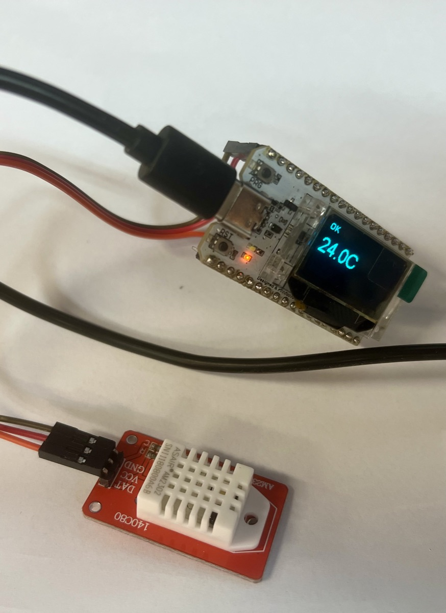
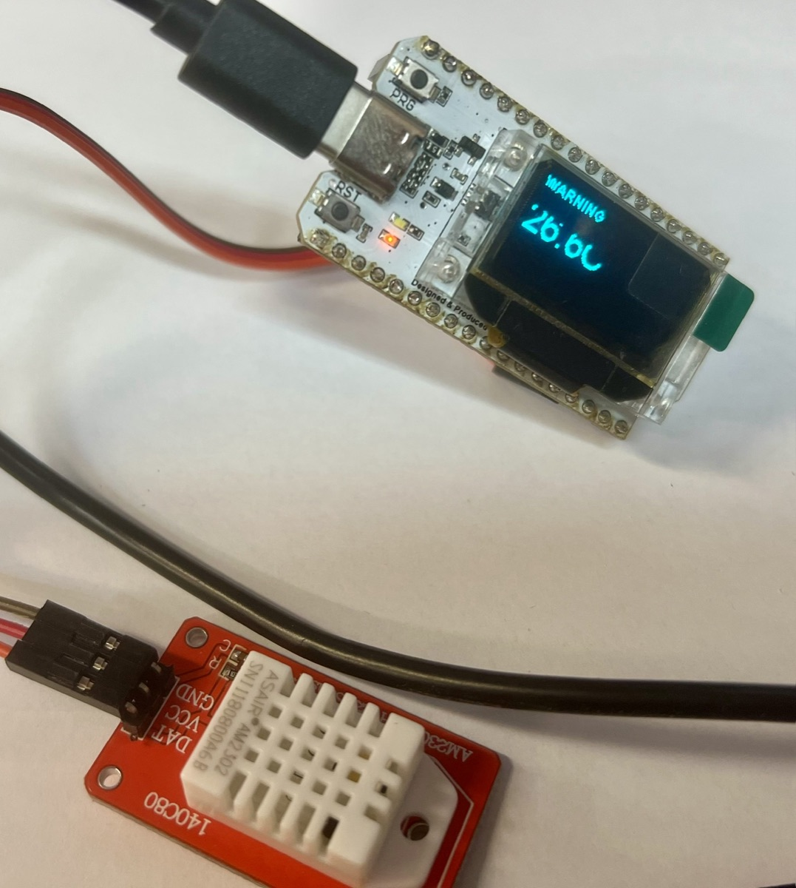

# Firmware: Heltec Environmental Monitor

Implements `specs/001-heltec-monitor/` (spec, plan, tasks) on the Heltec
WiFi Kit V3 (ESP32-S3). See that folder for the full spec and design
rationale; this file only covers build/test/flash mechanics.

## Hardware

- **Board**: Heltec WiFi Kit V3 (ESP32-S3FN8, 8MB flash), USB-C
- **OLED**: onboard 0.96" 128x64 SSD1306, I2C address `0x3C`
- **I2C pins**: `SDA=GPIO17`, `SCL=GPIO18`, `RST=GPIO21` (the board's
  dedicated OLED pins — **not** the generic ESP32 default 21/22; see
  `docs/textbook.md`)
- **Power**: `Vext=GPIO36`, active LOW, gates power to the OLED and the
  fitted sensor (max 350mA combined)
- **Sensor** — two interchangeable options, selected at build time (see
  [GitHub issue #2](https://github.com/ronyronen/speckit-claude-presentation/issues/2)):
  - **DHT22 / AM2302** (`heltec_wifi_kit_32_V3_dht22` env, **default**):
    3-pin module (GND/VCC/DATA), pull-up resistor built into the module,
    DATA on `GPIO4`. Temperature only — humidity is a suggested student
    extension. `pio run`/`upload` with no `-e` targets this env.
  - **BME280** (`heltec_wifi_kit_32_V3` env): I2C address `0x76`
    (fallback `0x77`), wired to the same I2C bus as the OLED.

## Build & test

```bash
# Native unit tests for the decision logic -- no board required
pio test -e native

# Build for the board -- DHT22 is the default env
pio run
# ...or explicitly:
pio run -e heltec_wifi_kit_32_V3_dht22   # DHT22
pio run -e heltec_wifi_kit_32_V3         # BME280

# Flash and observe (board required)
pio run -t upload                          # DHT22 (default)
# or: pio run -e heltec_wifi_kit_32_V3 -t upload   # BME280
pio device monitor -b 115200
```

## Verified build output (checkpoint `08-implemented`, re-verified 2026-09-14 for GitHub issue #2)

```text
$ pio test -e native
11 test cases: 11 succeeded

$ pio run -e heltec_wifi_kit_32_V3
RAM:   [=         ]   7.1% (used 23124 bytes from 327680 bytes)
Flash: [=         ]  10.8% (used 362595 bytes from 3342336 bytes)
========================= [SUCCESS] Took 20.48 seconds =========================

$ pio run -e heltec_wifi_kit_32_V3_dht22
RAM:   [=         ]   7.0% (used 23004 bytes from 327680 bytes)
Flash: [=         ]  10.6% (used 353235 bytes from 3342336 bytes)
========================= [SUCCESS] Took 7.86 seconds =========================
```

## Hardware verification (checkpoint `09-hardware-verified`)

Verified 2026-09-14 on the physical board with the DHT22/AM2302 fitted
(GPIO4, per `specs/001-heltec-monitor/research.md`): flashed the default
`heltec_wifi_kit_32_V3_dht22` env, confirmed temperature + state display
on the OLED, the 27.0°C/25.0°C hysteresis band, and sensor
disconnect/reconnect recovery per `quickstart.md` steps 3–5 — all working
as specified.

| OK state | WARNING state |
|---|---|
|  |  |

## Source layout

| File | Role |
|---|---|
| `include/monitor_logic.h` | `MonitorState`/`Reading`/`State` types — Constitution Principle I: no hardware includes |
| `src/monitor_logic.cpp` | The pure decision logic (hysteresis, debounce) |
| `src/sensor_adapter.h` | Shared `SensorAdapter` interface, common to both sensors |
| `src/sensor_adapter_dht22.cpp` | DHT22 (GPIO4) read, returns a `Reading` — compiled only into `heltec_wifi_kit_32_V3_dht22` |
| `src/sensor_adapter_bme280.cpp` | BME280 I2C read, returns a `Reading` — compiled only into `heltec_wifi_kit_32_V3` |
| `src/display_adapter.*` | SSD1306Wire OLED rendering per state |
| `src/serial_reporter.*` | One line per cycle, `contracts/serial-diagnostic-line.md` |
| `src/power.*` | Vext (GPIO36) power-rail control |
| `src/main.cpp` | Wires the above together in `setup()`/`loop()` — identical for both sensor envs |
| `test/test_monitor_logic/` | Native unit tests (`pio test -e native`) |
